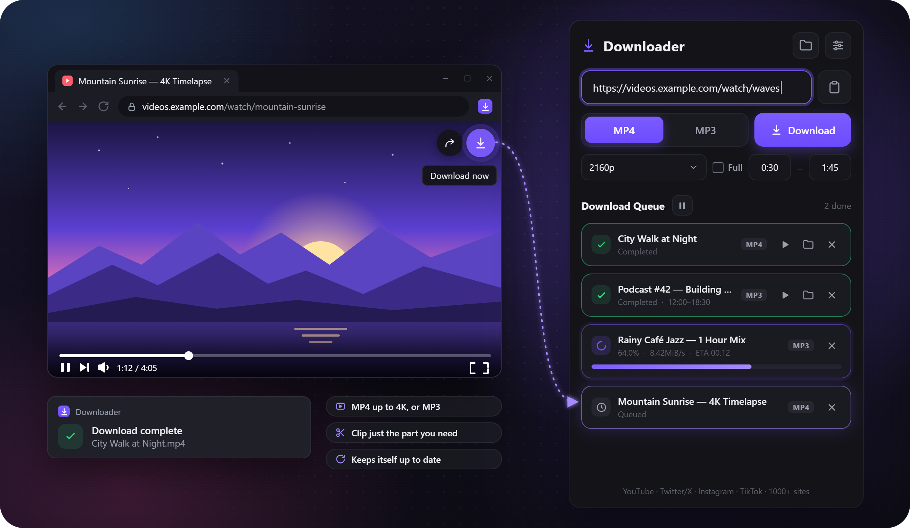

# Downloader

**A simple video and audio downloader for Windows.** Paste a link from YouTube, X (Twitter), Instagram, TikTok or 1000+ other sites and get an MP4 or an MP3.

  

## Download

**[Download the latest version](https://github.com/Roalinn/Downloader/releases/latest)** → `Downloader-Setup-x.y.z.exe`

- Windows 10 or 11, 64-bit. No admin rights needed.
- The installer isn't code-signed yet, so Windows may say "Windows protected your PC": click **More info → Run anyway**.
- If FFmpeg isn't on your PC yet, setup downloads it for you (~115 MB).

## Features

- **MP4** in the quality you pick (up to 4K), or **MP3**
- **Clip:** download just part of a video (start – end)
- **Queue:** add as many links as you like; pause and resume
- **Chrome extension:** a download button right on the video
- Keeps itself, yt-dlp and FFmpeg up to date
- English and Turkish
- Waits in the system tray and can start with Windows

## Chrome extension

The extension isn't in the Chrome Web Store; it comes with Downloader. Tick **Set up the Chrome extension** on the last page of setup, or open **Settings → Chrome extension → Install**, and Downloader walks you through the three steps.

## Bugs and ideas

Found a bug or have an idea? **[Open an issue](https://github.com/Roalinn/Downloader/issues/new)**. For a bug, please mention your Downloader version (Settings → Application), what happened, and the video link if there is one.

---

This repository hosts the releases and issue reports only. 
Built with [yt-dlp](https://github.com/yt-dlp/yt-dlp) (Unlicense), [Deno](https://deno.com) (MIT) and [Electron](https://www.electronjs.org) (MIT). [FFmpeg](https://ffmpeg.org) (GPL) is not bundled: it is downloaded separately from [Gyan's builds](https://www.gyan.dev/ffmpeg/builds/).
